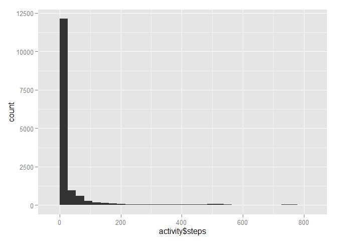
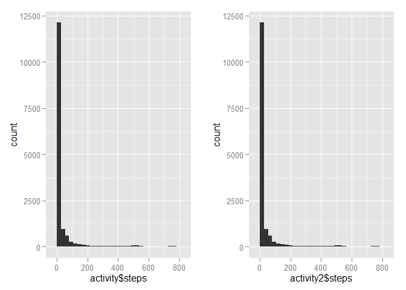
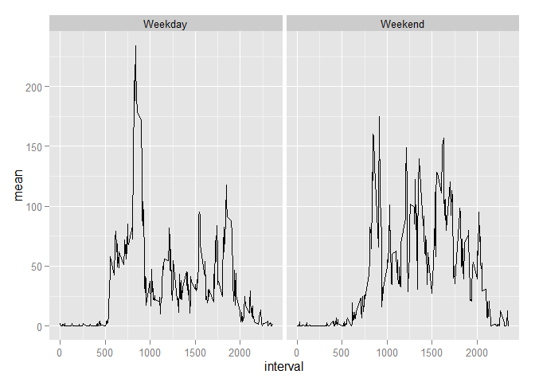

# Reproducible Research: Peer Assessment 1


## Loading and preprocessing the data

```r
library(ggplot2)
library(plyr)
library(Hmisc)
```

```
## Warning: package 'Hmisc' was built under R version 3.2.2
```

```
## Loading required package: grid
## Loading required package: lattice
## Loading required package: survival
## Loading required package: Formula
```

```
## Warning: package 'Formula' was built under R version 3.2.2
```

```
## 
## Attaching package: 'Hmisc'
## 
## The following objects are masked from 'package:plyr':
## 
##     is.discrete, summarize
## 
## The following objects are masked from 'package:base':
## 
##     format.pval, round.POSIXt, trunc.POSIXt, units
```

```r
library(Rmisc)
```

```
## Warning: package 'Rmisc' was built under R version 3.2.2
```

```r
activity <- read.table(unz("activity.zip", "activity.csv"), header=T, quote="\"", sep=",")
```


## What is mean total number of steps taken per day?
Calculating the number of steps taken per day

```r
attach(activity)
#tapply(steps, date, sum)
stepsperday=ddply(activity,.(activity$date),summarise,totalsteps = sum(steps,na.rm=TRUE))
summary(stepsperday$totalsteps)
```

```
##    Min. 1st Qu.  Median    Mean 3rd Qu.    Max. 
##       0    6778   10400    9354   12810   21190
```
the mean steps are 9354


```r
p1=qplot(activity$steps, geom="histogram") 
p1
```

```
## stat_bin: binwidth defaulted to range/30. Use 'binwidth = x' to adjust this.
```

 


## What is the average daily activity pattern?

the code below takes the mean steps for each interval and plots the result
then sorts the data by the number of steps and lists the top 6

```r
timeint=ddply(activity,.(interval),summarise,mean = mean(steps,na.rm=TRUE))
plot(mean ~ interval, type = "l", data = timeint)
```

 

```r
timeint=timeint[order(timeint$mean),]
tail (timeint)
```

```
##     interval     mean
## 101      820 171.1509
## 103      830 177.3019
## 106      845 179.5660
## 107      850 183.3962
## 105      840 195.9245
## 104      835 206.1698
```

## Imputing missing values

the code below first counts the number of missing values
then using ddply imputes missing values with the mean for the interval
then creates the mean steps by interval, orders the resulting dataframe with the imputed values
(timeint2) and summarizes


```r
sum(is.na(steps))
```

```
## [1] 2304
```

```r
activity2 <- ddply(activity, "interval", mutate, imputed.value = impute(steps, mean))
timeint2=ddply(activity2,.(interval),summarise,mean = mean(steps,na.rm=TRUE))
timeint2=timeint2[order(timeint2$mean),]
tail (timeint2)
```

```
##     interval     mean
## 101      820 171.1509
## 103      830 177.3019
## 106      845 179.5660
## 107      850 183.3962
## 105      840 195.9245
## 104      835 206.1698
```
no change in the period with the highest steps

plot histogram with imputation (p2) compared with without imputation (p1)


```r
p2=qplot(activity2$steps, geom="histogram") 
stepsperday2=ddply(activity2,.(activity2$date),summarise,totalsteps2 = sum(imputed.value,na.rm=TRUE))
multiplot(p1, p2,  cols=2)
```

```
## stat_bin: binwidth defaulted to range/30. Use 'binwidth = x' to adjust this.
## stat_bin: binwidth defaulted to range/30. Use 'binwidth = x' to adjust this.
```

 
calculate and compare mean and median with and without imputation


```r
summary(stepsperday$totalsteps)
```

```
##    Min. 1st Qu.  Median    Mean 3rd Qu.    Max. 
##       0    6778   10400    9354   12810   21190
```

```r
summary(stepsperday2$totalsteps2)
```

```
##    Min. 1st Qu.  Median    Mean 3rd Qu.    Max. 
##      41    9819   10770   10770   12810   21190
```


## Are there differences in activity patterns between weekdays and weekends?

convert date into days of the week
create factor indicating weekdays and weekend using chron package


```r
activity2$day <- weekdays(as.Date(activity2$date))
activity2$factor=as.factor(activity2$day)
library(chron)
```

```
## Warning: package 'chron' was built under R version 3.2.2
```

```r
activity2$weekend = chron::is.weekend(activity2$date)
```

finally creates dataframe with average of steps by interval separated by two levels (weekday and weekend)
plots both next to eachother


```r
timeint3=ddply(activity2,.(interval, weekend),summarise,mean = mean(steps,na.rm=TRUE))
timeint3$weekend=as.factor(timeint3$weekend)
timeint3$weekend=revalue(timeint3$weekend, c("TRUE"="Weekend", "FALSE"="Weekday"))

plot <- ggplot(timeint3, aes(x=interval, y=mean)) + geom_line(shape=1)

plot + facet_grid(. ~ weekend)
```

 
on weekdays activity is concentrated early in the mornings.
on weekends it is distributed across the day


